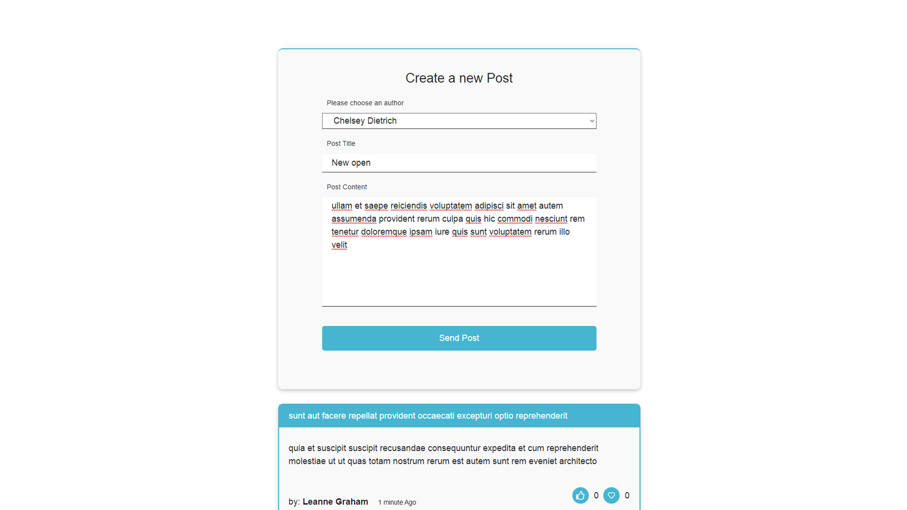

# Post Management App

The **Post Management App** is a web application built with React and Redux for managing and displaying posts authored by various users. This application allows users to view, create, and react to posts. It also demonstrates best practices in structuring a React application, handling asynchronous operations with Redux Thunk, and responsive design using CSS.

## What I Have Learned
During the development of this project, I have learned and applied the following skills and concepts:

Creating a structured React application with modular components.
Managing application state using Redux and Redux Thunk for asynchronous actions.
Building user-friendly forms for data input and submission.
Implementing responsive web design with CSS to ensure compatibility across devices.
Leveraging third-party APIs, such as JSONPlaceholder, for testing and prototyping.
The most important aspect was refactoring code from JavaScript to TypeScript.

## About

The **Post Management App** is designed to showcase how to build a modern web application using React and Redux. It demonstrates the base concepts for further implementation.

## Technologies Used
React 
Redux 
Typescript
JSONPlaceholder: A fake online REST API for testing and prototyping.

### Installation
Clone the repository to your local machine:
git clone https://github.com/mkulDev/Redux-simple-form.git

